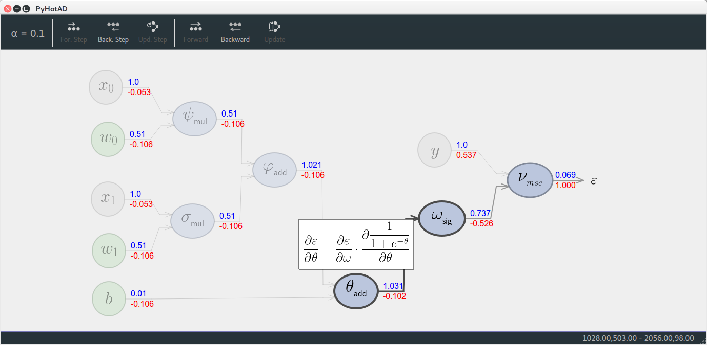
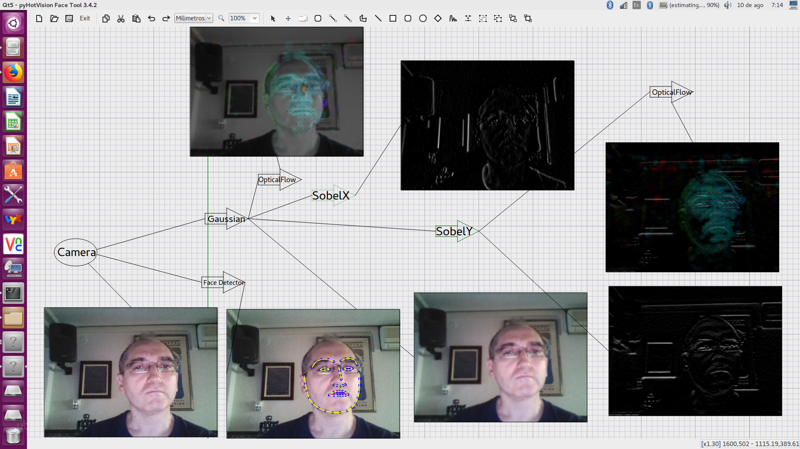

# pyHotDraw
The Python 2.7-3.5 version of JHotDraw.
It is aim to be GUI platform independent, but now only work with Qt4, Qt5, pySide4 and OpenCV GUI!!!.
It is the framework used on:
* pyHotCADCAM a CAD with CAM integrated application to use in 2D.
* pyHotAD a tool to learn how back propagation works and to build computation graphs. It can generate Python code for Tensorflow of the graph in a Notebook.
* pyHotVision a visual tool to work with Computer Vision. OpenCV and dlib needed.
* pyHotGraphSLAM, a visual tool to play with GraphSLAM in order to learn concepts.Inspired by Udacity.

